# MEAGL
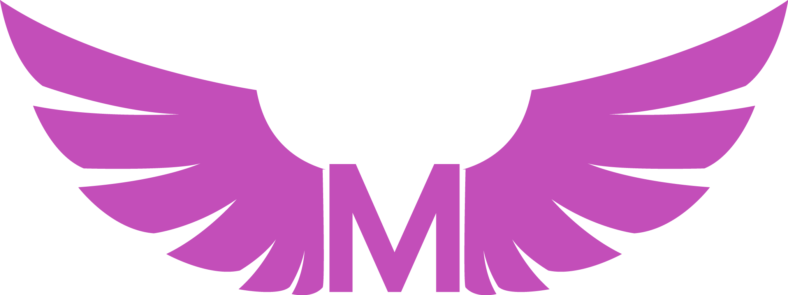
Meagl is the place where memers can make making memes a career. Just post your memes and your audience can send you tips!

 
<h2>Home Page</h2>
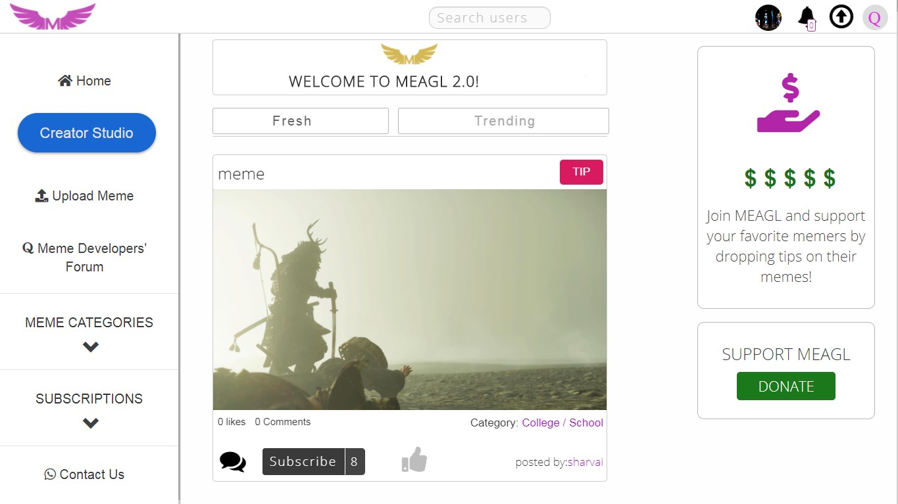

 
<h2>Sign Up / Log In</h2>
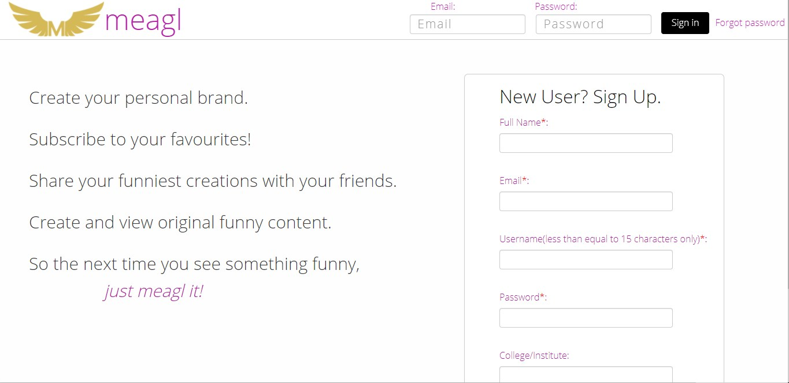

 
<h2>Userprofile Page</h2>
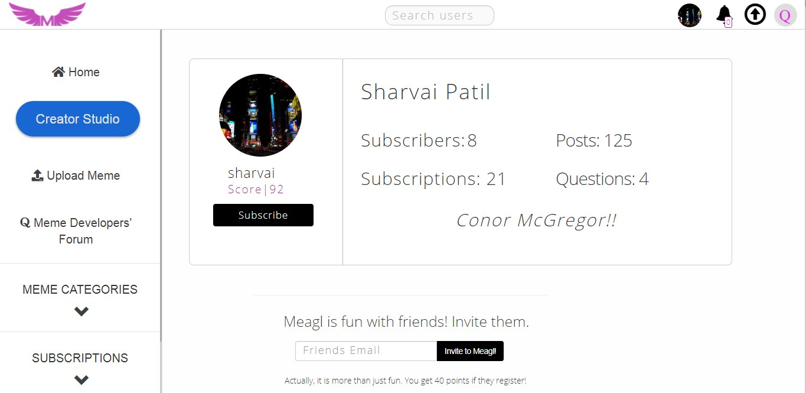
 
These are the tabs under the profile page:
1. My Memes tab and the notifications bar
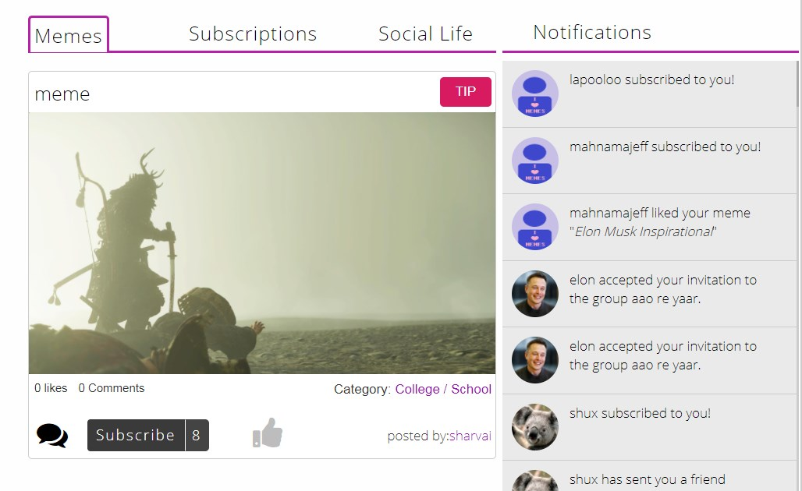 
2. My Subscriptions tab
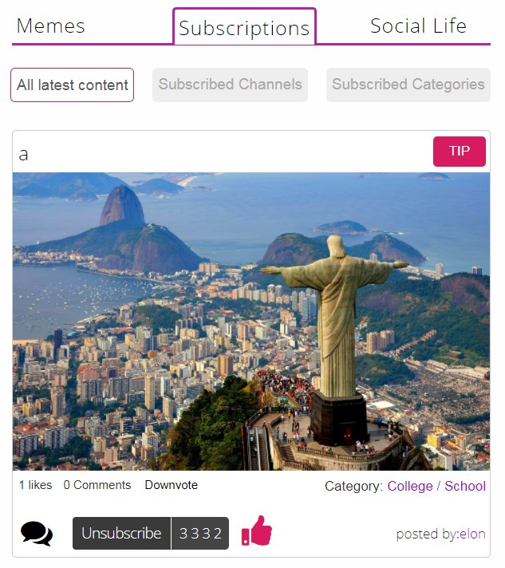
3. My Social Like tab
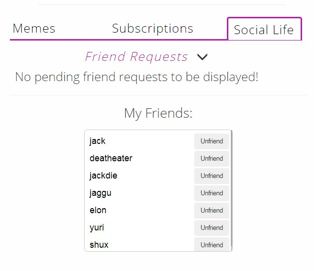

 
<h2>Dedicated Meme Page</h2>
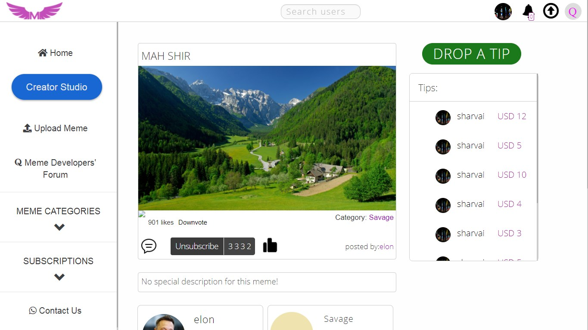
Next, lets look at the comments section:
 
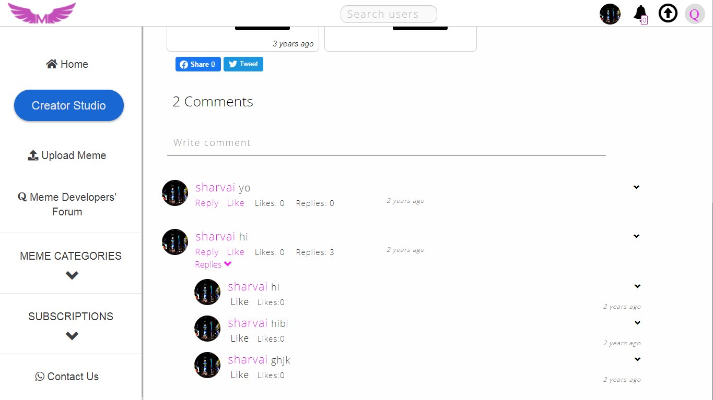

 
<h2>Creating a channel</h2> 
One has to create a channel to enable tipping. The process is as follows: 
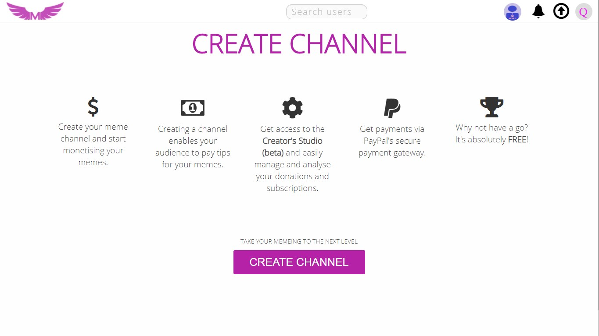 
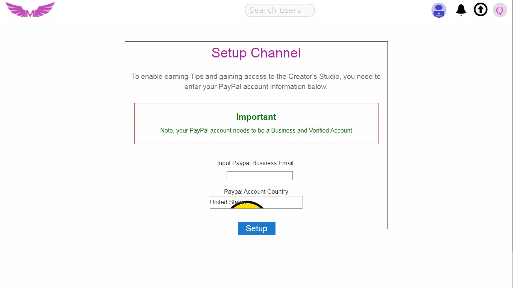

 
<h2>Tipping a meme</h2>
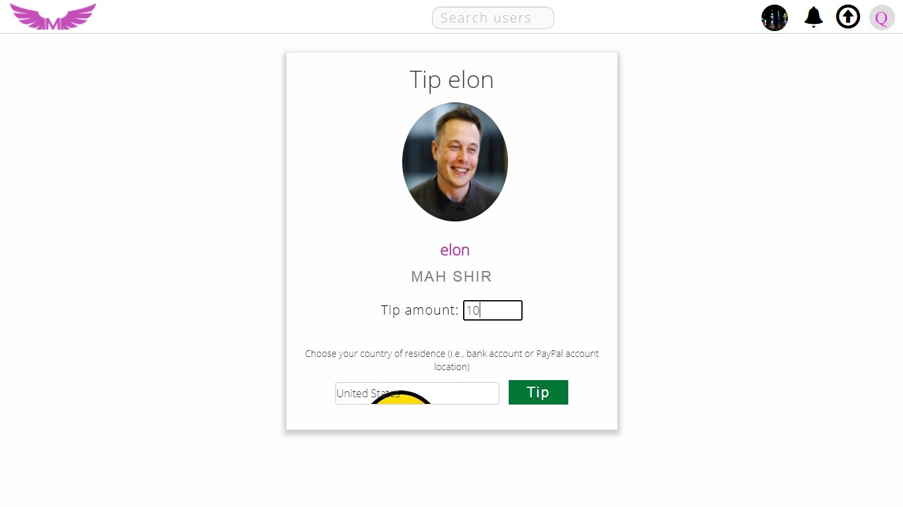

