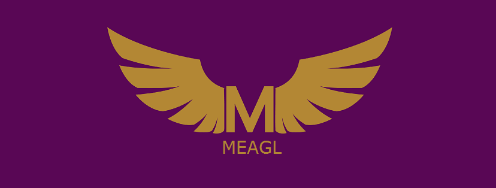

<h2 align="center">MEAGL: Earn money from your memes</h2>

       

Meagl is the place where memers can make making memes a career. Just post your memes and your audience can send you tips!

 
<h2>Home Page</h2>

<kbd>
  
</kbd>

 
<h2>Sign Up / Log In</h2>

<kbd>
  
</kbd>

 
<h2>Userprofile Page</h2>

<kbd>

</kbd>
  
These are the tabs under the profile page:  
1. My Memes tab and the notifications bar 
<kbd></kbd>  
2. My Subscriptions tab 
<kbd></kbd>  
3. My Social Like tab 
<kbd></kbd>

 
<h2>Dedicated Meme Page</h2>
<kbd></kbd>  
Next, lets look at the comments section:
 
<kbd></kbd>

 
<h2>Creating a channel</h2> 
One has to create a channel to enable tipping. The process is as follows: 
<kbd></kbd>  
<kbd></kbd>

 
<h2>Tipping a meme</h2>
<kbd></kbd>

